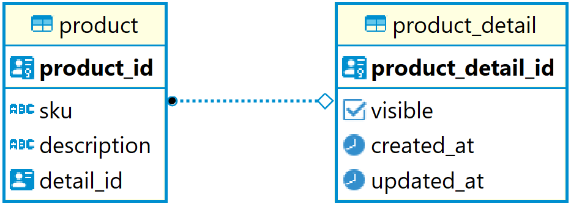
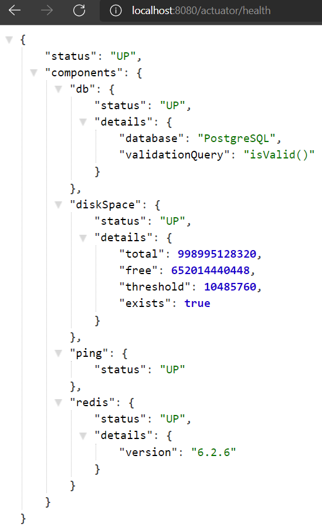
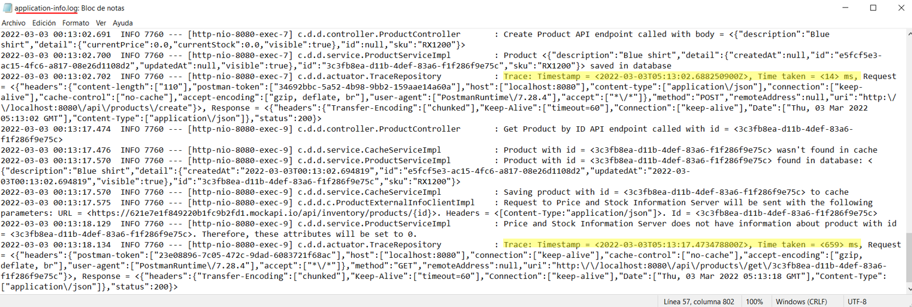
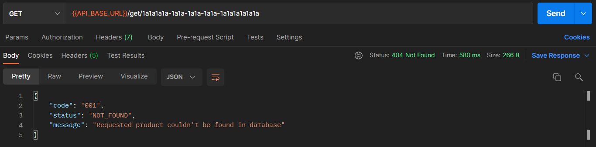
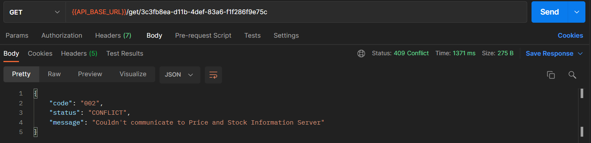
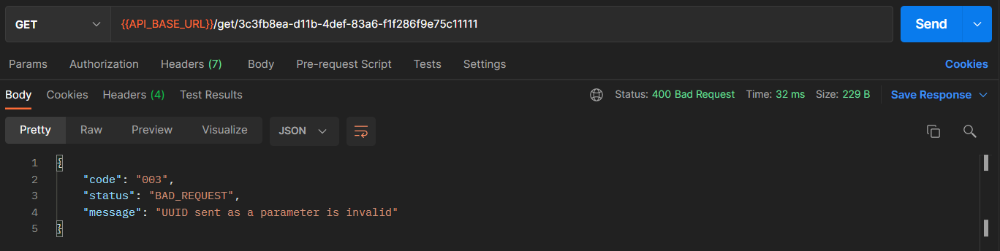
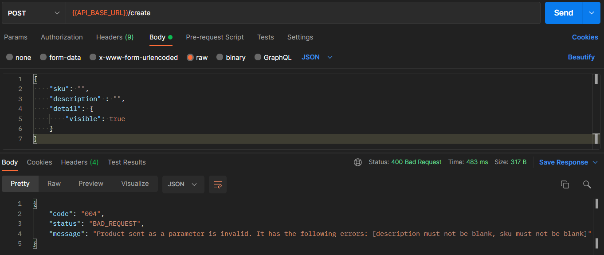

# Digital Product System
Simple inventory system that stores products' information. It has been developed in Java using Spring Framework and includes unit and integration testing with JUnit 5 and Mockito. It uses PostgreSQL as its main database and Redis as an in-memory cache. It also has a Dockerfile to easily create the container's image and set everything up.

## Technologies used
 &nbsp; &nbsp;  &nbsp; &nbsp;  &nbsp; &nbsp;  &nbsp; &nbsp; 

## How does it work

The product system save the following properties for each product:  

It exposes 3 endpoints. All of them have "/api/products" as base URL.
| Endpoint | Action | Path Parameter | Body | Response
| --- | --- | --- | --- | -- |
| /create | Create a new product | - | {   &nbsp; &nbsp; "sku": String,   &nbsp; &nbsp; "description" : String,   &nbsp; &nbsp; "detail": {    &nbsp; &nbsp;  &nbsp; &nbsp; "visible": boolean   &nbsp; &nbsp; }   } | {   &nbsp; &nbsp; "sku": String,   &nbsp; &nbsp; "description" : String,   &nbsp; &nbsp; "detail": {   &nbsp; &nbsp; &nbsp; &nbsp; "currentPrice": double   &nbsp; &nbsp; &nbsp; &nbsp; "currentStock": double   &nbsp; &nbsp; &nbsp; &nbsp; "visible": boolean   &nbsp; &nbsp; }   }
| /get/{id} | Get a product by its id | id: String (UUID)      	    | - | {   &nbsp; &nbsp; "sku": String,   &nbsp; &nbsp; "description" : String,   &nbsp; &nbsp; "detail": {   &nbsp; &nbsp; &nbsp; &nbsp; "currentPrice": double   &nbsp; &nbsp; &nbsp; &nbsp; "currentStock": double   &nbsp; &nbsp; &nbsp; &nbsp; "visible": boolean   &nbsp; &nbsp; }   }
| /update/{id} | Update a product | id: String (UUID)    	    | {   &nbsp; &nbsp; "sku": String,   &nbsp; &nbsp; "description" : String,   &nbsp; &nbsp; "detail": {   &nbsp; &nbsp; &nbsp; &nbsp; "visible": boolean   &nbsp; &nbsp; }   } | {   &nbsp; &nbsp; "sku": String,   &nbsp; &nbsp; "description" : String,   &nbsp; &nbsp; "detail": {   &nbsp; &nbsp; &nbsp; &nbsp; "currentPrice": double   &nbsp; &nbsp; &nbsp; &nbsp; "currentStock": double   &nbsp; &nbsp; &nbsp; &nbsp; "visible": boolean   &nbsp; &nbsp; }   }

The **currentPrice** and **currentStock** attributes are retrieved from an external API. To mock this behavior, an API in mockapi.io has been created: **https://mockapi.io/projects/621e7e1f849220b1fc9b2fd2**. This mock API just exposes 1 endpoint:
| Endpoint | Action | Path Parameter | Body | Response
| --- | --- | --- | --- | -- |
| /api/inventory/products/{id} | Get a product's price and stock by its id | id: String (UUID) | - | {   &nbsp; &nbsp; "id": String,   &nbsp; &nbsp; "price" : String,   &nbsp; &nbsp; "stock": String   }

Keep in mind that creating a product **does not** set its price and stock. Therefore, its **price and stock** will be returned as **0** since the external API does not have information about them. If you are trying to get real values of price and stock, please use the following ids (these products have already been created in mockapi.io):
- 706507fd-0d1e-4c08-9671-acd35b5d35f2
- a414a6e1-ffb8-427d-b4b1-c6ebb771a6c9
- 1ed48d61-ab5b-44fb-9322-5b9106333017
- 1fdf619e-fe59-4fdd-bc81-7a8d3596aede

### Additional features
- The system implements a Lazy Loading cache strategy. When retrieving a product, it first checks the cache. If a cache hit occurs, the product is retrieved. If not, the data will be requested from the database and the cache will be updated. The cache duration is set through an environment property (default = 5 minutes).

- Health check is exposed through the **/actuator/health** endpoint.
  

- Logs are written to a file called **application-info.log** located in the **logs** folder. Each request is traced and the information about it (request, response and elapsed time) is also printed.
  

- The system manages environmental variables in the **application-yml** file, so that DEV and PROD environment can have different variables.

### Exceptions
If the request cannot be proxied to the requested URL, one of the following exceptions will appear on your browser:

| HTTP Status Code | Exception Code | Exception Name | Description
| --- | --- | --- | --- |
| 404 | 001 | ProductNotFoundInDatabaseException | Requested product couldn't be found in database
| 409 | 002 | GenericProductInfoApiException | Couldn't communicate to Price and Stock Information Server
| 400 | 003 | IllegalUUIDException | UUID sent as a parameter is invalid
| 400 | 004 | IllegalProductDtoException | Product sent as a parameter is invalid. It has the following errors: [...]

## How to run the application

To start the system quickly and easily, follow these steps:
- Make sure you have Docker installed
- Open your terminal and change your location to the project's root folder
- Build the app image by running the following command: **docker build digital-product:1.0 .** (This command uses of the Dockerfile)
- Run a Postgres container (e.g. postgres:13.1-alpine), a Redis container (e.g. redis:6.2.6) and the recently built app image.